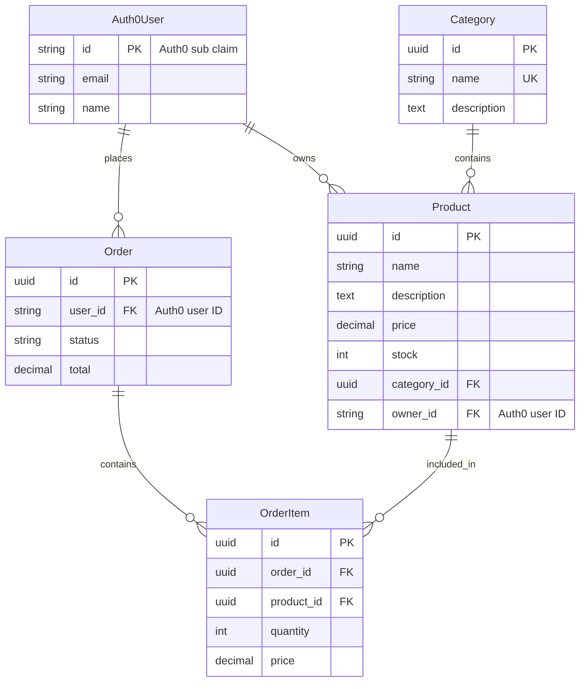

# AI Code Generation Prompt Template

Use this prompt template with Claude Code or other AI assistants to automatically generate models, schemas, services, and routes from your database schema.

---

## How to Use

1. Copy the prompt template below
2. Replace ALL `[PLACEHOLDER]` sections with your actual data
3. Paste the complete prompt to Claude Code
4. Review and refine the generated code

---

## Prompt Template

````markdown
# Generate FastAPI Code from Database Schema

## Application Overview

### App Name & Purpose
[APP_NAME]: [ONE_LINE_DESCRIPTION]

Example:
> **ShopEase**: An e-commerce platform for small businesses to sell products online

### Core Features & Modules

[LIST YOUR APP'S MAIN FEATURES/MODULES]

Example:
```
1. **User Management**
   - User registration and authentication (via Auth0)
   - Profile management
   - Role-based access (Admin, Seller, Customer)

2. **Product Catalog**
   - Product listing with categories
   - Inventory management
   - Product search and filtering

3. **Order Management**
   - Shopping cart
   - Checkout process
   - Order tracking and history

4. **Reviews & Ratings**
   - Product reviews
   - Seller ratings
```

### Business Rules & Constraints

[DESCRIBE KEY BUSINESS RULES]

Example:
```
- Users must verify email before purchasing
- Sellers need admin approval before listing products
- Orders over $100 get free shipping
- Products with 0 stock cannot be ordered
- Reviews can only be posted after purchase
- Maximum 5 images per product
```

### User Roles & Permissions

[DEFINE YOUR USER ROLES - These will be configured in Auth0]

Example:
```
| Role     | Description                    | Key Permissions                    |
|----------|--------------------------------|------------------------------------|
| Admin    | Platform administrator         | Full access, user management       |
| Seller   | Product seller                 | Manage own products, view orders   |
| Customer | Regular buyer                  | Browse, purchase, review           |
| Guest    | Unauthenticated user           | Browse only                        |
```

### API Endpoints Overview

[DESCRIBE MAIN API AREAS]

Example:
```
/api/v1/users/*      - User profiles (Auth0 handles auth)
/api/v1/products/*   - Product catalog
/api/v1/categories/* - Product categories
/api/v1/orders/*     - Order management
/api/v1/cart/*       - Shopping cart
/api/v1/reviews/*    - Product reviews
```

---

## Technical Context

I'm using a FastAPI template with the following patterns:
- SQLAlchemy 2.0 async models (inherit from `BaseModel` in `app/models/base.py`)
- Pydantic V2 schemas with `ConfigDict(from_attributes=True)`
- Generic CRUD services (inherit from `CRUDService` in `app/services/crud_service.py`)
- Route Factory pattern using `CRUDRouter` (in `app/routes/crud_router.py`)
- **Auth0 authentication** with `Auth0User` model (in `app/core/permissions.py`)
- RBAC permissions managed in Auth0 dashboard

### Authentication Notes
- User authentication is handled by Auth0
- Current user is obtained via `get_current_user` dependency returning `Auth0User`
- Permissions are in format: `{resource}:{action}` (e.g., `products:read`)
- Permissions must be added to Auth0 API in dashboard

---

## Database Schema

[PASTE YOUR SCHEMA HERE - Use one of the formats below]

### Option A: Prisma Schema Format
```prisma
model Product {
  id          String   @id @default(uuid())
  name        String
  description String?
  price       Decimal
  stock       Int      @default(0)
  categoryId  String
  ownerId     String   // Auth0 user ID (sub claim)
  category    Category @relation(fields: [categoryId], references: [id])
  createdAt   DateTime @default(now())
  updatedAt   DateTime @updatedAt
}

model Category {
  id          String    @id @default(uuid())
  name        String    @unique
  description String?
  products    Product[]
  createdAt   DateTime  @default(now())
  updatedAt   DateTime  @updatedAt
}
```

### Option B: SQL/DDL Format
```sql
CREATE TABLE categories (
    id UUID PRIMARY KEY DEFAULT gen_random_uuid(),
    name VARCHAR(255) UNIQUE NOT NULL,
    description TEXT,
    created_at TIMESTAMP DEFAULT CURRENT_TIMESTAMP,
    updated_at TIMESTAMP DEFAULT CURRENT_TIMESTAMP
);

CREATE TABLE products (
    id UUID PRIMARY KEY DEFAULT gen_random_uuid(),
    name VARCHAR(255) NOT NULL,
    description TEXT,
    price DECIMAL(10,2) NOT NULL,
    stock INTEGER DEFAULT 0,
    category_id UUID REFERENCES categories(id),
    owner_id VARCHAR(255) NOT NULL,  -- Auth0 user ID
    created_at TIMESTAMP DEFAULT CURRENT_TIMESTAMP,
    updated_at TIMESTAMP DEFAULT CURRENT_TIMESTAMP
);
```

### Option C: Plain Text Description
```
Entity: Product
- id: UUID (primary key, auto-generated)
- name: string (required, max 255 chars)
- description: text (optional)
- price: decimal (required, min 0)
- stock: integer (default 0, min 0)
- category_id: UUID (foreign key to Category)
- owner_id: string (Auth0 user ID, required)
- is_active: boolean (default true)
- created_at: timestamp
- updated_at: timestamp

Entity: Category
- id: UUID (primary key, auto-generated)
- name: string (required, unique, max 255 chars)
- description: text (optional)
- created_at: timestamp
- updated_at: timestamp

Relationships:
- Product belongs to Category (many-to-one)
- Product is owned by Auth0 User (many-to-one, via owner_id string)
- Category has many Products (one-to-many)
```

### Option D: ER Diagram (Mermaid)


---

## Generation Requirements

Please generate the following files for each entity:

### 1. SQLAlchemy Model
Location: `app/models/{entity_name}.py`

Requirements:
- Inherit from `BaseModel` (provides id, created_at, updated_at)
- Use SQLAlchemy 2.0 style
- For user-owned entities, use `owner_id: str` (Auth0 user ID)
- Define relationships with `back_populates`
- Add appropriate indexes and constraints

### 2. Pydantic Schemas
Location: `app/schemas/{entity_name}.py`

Requirements:
- Base schema with shared fields
- Create schema (for POST requests)
- Update schema (all fields optional)
- Response/Output schema with `ConfigDict(from_attributes=True)`
- Use proper field validation (min_length, max_length, ge, le, etc.)

### 3. Service Class
Location: `app/services/{entity_name}_service.py`

Requirements:
- Inherit from `CRUDService[Model, CreateSchema, UpdateSchema]`
- Add custom business logic methods based on app requirements
- Include `get_all_by_user` method if user-owned entity
- Include `verify_{entity}_access` method for self endpoints
- User ID comes from `Auth0User.id` (string)

### 4. Routes
Location: `app/routes/{entity_name}.py`

Requirements:
- Use `CRUDRouter` for standard CRUD endpoints
- Import `Auth0User` from `app.core.permissions`
- Set appropriate `resource_name` for permissions
- Add custom endpoints based on business requirements
- Enable `enable_self_endpoints=True` if user-owned

### 5. Registration
Show how to register in `app/routes/__init__.py` and `app/models/__init__.py`

### 6. Migration Command
Show the Alembic migration command to run

### 7. Auth0 Permissions
List permissions to add in Auth0 Dashboard → APIs → Your API → Permissions

---

## Permission Structure

For RBAC, permissions are added to Auth0 API dashboard:
- `{entity}:read` - Read all
- `{entity}:write` - Create/Update
- `{entity}:delete` - Delete
- `{entity}:admin` - Admin access
- `{entity}:read:self` - Read own (if user-owned)
- `{entity}:write:self` - Update own (if user-owned)
- `{entity}:delete:self` - Delete own (if user-owned)

**Important**: Add these permissions in Auth0 Dashboard, not in code!

---

## Custom Requirements

[ADD ANY SPECIFIC REQUIREMENTS HERE]

Examples:
- "Products should have soft delete"
- "Categories should be cached for 1 hour"
- "Only admins can create categories"
- "Sellers can only see their own products"
- "Include a search endpoint by name and category"
- "Add an endpoint to get top-selling products"
- "Orders should send email notification on status change"

````

---

## Application Context Templates

### Template 1: E-Commerce Platform

```markdown
## Application Overview

### App Name & Purpose
**ShopHub**: Multi-vendor e-commerce marketplace connecting sellers with customers

### Core Features & Modules
1. **User Management** - Auth0 authentication, profiles (Admin/Seller/Customer roles in Auth0)
2. **Product Catalog** - Products, categories, inventory, images
3. **Shopping** - Cart, wishlist, checkout
4. **Orders** - Order processing, tracking, history
5. **Reviews** - Product reviews and ratings
6. **Payments** - Payment processing, refunds

### Business Rules
- Sellers must be verified (custom Auth0 rule) before listing products
- Minimum order value: $10
- Products require at least one image
- Reviews only after confirmed purchase
- Auto-cancel orders not paid within 24 hours

### User Roles (Auth0)
| Role     | Auth0 Permissions |
|----------|-------------------|
| Admin    | *:admin, *:read, *:write, *:delete |
| Seller   | products:read:self, products:write:self, orders:read |
| Customer | products:read, orders:read:self, reviews:write:self |
```

### Template 2: Project Management App

```markdown
## Application Overview

### App Name & Purpose
**TaskFlow**: Team project management and collaboration platform

### Core Features & Modules
1. **Workspace Management** - Organizations, teams
2. **Project Management** - Projects, milestones, deadlines
3. **Task Management** - Tasks, subtasks, assignments
4. **Collaboration** - Comments, attachments, mentions
5. **Time Tracking** - Time logs, reports
6. **Notifications** - Real-time updates, email alerts

### Business Rules
- Each project belongs to one workspace
- Tasks must have an assignee
- Only project members can view project content
- Completed tasks cannot be edited (only reopened)
- Time entries cannot be modified after 7 days

### User Roles (Auth0)
| Role         | Auth0 Permissions |
|--------------|-------------------|
| Owner        | workspaces:admin, projects:admin, *:read, *:write |
| Admin        | projects:write, members:write, tasks:admin |
| Member       | tasks:read:self, tasks:write:self, comments:write |
| Guest        | projects:read (specific), tasks:read (specific) |
```

### Template 3: Healthcare/Appointment System

```markdown
## Application Overview

### App Name & Purpose
**MediBook**: Healthcare appointment scheduling and patient management

### Core Features & Modules
1. **User Management** - Patients, doctors, staff (Auth0 roles)
2. **Doctor Profiles** - Specializations, availability
3. **Appointments** - Booking, rescheduling, cancellation
4. **Medical Records** - Patient history, prescriptions
5. **Notifications** - Reminders, confirmations
6. **Billing** - Invoices, payments

### Business Rules
- Appointments require 24-hour advance booking
- Cancellation free up to 4 hours before
- Only assigned doctor can view patient records
- Prescription requires valid appointment
- Maximum 3 appointments per day per patient

### User Roles (Auth0)
| Role    | Auth0 Permissions |
|---------|-------------------|
| Admin   | *:admin |
| Doctor  | appointments:read:self, prescriptions:write, records:read |
| Staff   | appointments:write, billing:write |
| Patient | appointments:read:self, appointments:write:self, records:read:self |
```

### Template 4: Content Management System

```markdown
## Application Overview

### App Name & Purpose
**ContentHub**: Blog and content management platform

### Core Features & Modules
1. **User Management** - Authors, editors, readers (Auth0)
2. **Content** - Posts, pages, drafts
3. **Media** - Images, files, galleries
4. **Categories & Tags** - Organization, taxonomy
5. **Comments** - Discussions, moderation
6. **SEO** - Meta tags, slugs, sitemaps

### Business Rules
- Posts require editor approval before publishing
- Slug must be unique per post type
- Comments require moderation for new users
- Media files max 10MB
- Authors can only edit own drafts

### User Roles (Auth0)
| Role   | Auth0 Permissions |
|--------|-------------------|
| Admin  | *:admin |
| Editor | posts:write, posts:publish, comments:moderate |
| Author | posts:read:self, posts:write:self, media:write:self |
| Reader | posts:read, comments:write |
```

### Template 5: SaaS Subscription Platform

```markdown
## Application Overview

### App Name & Purpose
**SubStack**: SaaS subscription and billing management

### Core Features & Modules
1. **Tenant Management** - Organizations, workspaces
2. **User Management** - Team members, invitations (Auth0 Organizations)
3. **Subscription** - Plans, billing cycles
4. **Billing** - Invoices, payments, usage
5. **Features** - Feature flags, limits
6. **Analytics** - Usage metrics, reports

### Business Rules
- One owner per organization
- Downgrade only at billing cycle end
- Usage limits based on plan tier
- 14-day trial for new organizations
- Payment required before trial end

### User Roles (Auth0)
| Role   | Auth0 Permissions |
|--------|-------------------|
| Owner  | organizations:admin, billing:admin, members:admin |
| Admin  | members:write, settings:write |
| Member | features:read, usage:read:self |
```

---

## Quick Generation Prompts

### Full App Generation
```
I'm building [APP_NAME]: [DESCRIPTION]

Core features:
[LIST FEATURES]

User roles (to configure in Auth0):
[LIST ROLES]

Here's my database schema:
[PASTE SCHEMA]

Generate complete code for all entities following the FastAPI + Auth0 template patterns.
```

### Single Entity with Context
```
App context: [APP_NAME] - [BRIEF DESCRIPTION]
Authentication: Auth0 with Auth0User model

Generate code for the [ENTITY_NAME] entity:
[PASTE ENTITY SCHEMA]

Business rules:
- [RULE 1]
- [RULE 2]

This entity is owned by Auth0 users and should have self endpoints.
```

### Add Feature to Existing App
```
I have an existing [APP_TYPE] app using Auth0. I need to add a new feature:

Feature: [FEATURE_NAME]
Purpose: [DESCRIPTION]

New entities needed:
[PASTE SCHEMA]

This feature should integrate with existing [EXISTING_ENTITIES].
Auth0 permissions needed: [LIST PERMISSIONS]
```

---

## Example Output Structure

When you provide your schema, Claude Code should generate:

```
app/
├── models/
│   ├── __init__.py          # Add imports
│   ├── product.py           # New model (owner_id: str for Auth0)
│   ├── category.py          # New model
│   └── order.py             # New model
├── schemas/
│   ├── product.py           # New schemas
│   ├── category.py          # New schemas
│   └── order.py             # New schemas
├── services/
│   ├── product_service.py   # With business logic
│   ├── category_service.py
│   └── order_service.py     # With order processing
└── routes/
    ├── __init__.py          # Register all routers
    ├── products.py          # CRUD + custom (uses Auth0User)
    ├── categories.py
    └── orders.py            # CRUD + status updates
```

---

## Auth0 Setup Checklist

After generating code, configure Auth0:

1. **Add Permissions to API**
   - Go to Auth0 Dashboard → APIs → Your API → Permissions
   - Add all `{entity}:read`, `{entity}:write`, etc. permissions

2. **Create/Update Roles**
   - Go to User Management → Roles
   - Create roles and assign permissions

3. **Enable RBAC**
   - API Settings → RBAC Settings
   - Enable "Add Permissions in the Access Token"

4. **Test with Token**
   - Use API Test tab to get test token
   - Verify permissions appear in JWT

---

## After Generation Checklist

- [ ] Review generated code for accuracy
- [ ] Verify relationships are correct
- [ ] Check business logic implementation
- [ ] Run `make migrate-create` to create migration
- [ ] Review migration file
- [ ] Run `make migrate` to apply migration
- [ ] **Add permissions to Auth0 Dashboard**
- [ ] **Assign permissions to Auth0 Roles**
- [ ] Test endpoints via Swagger UI at `/docs`
- [ ] Write unit tests for custom logic
