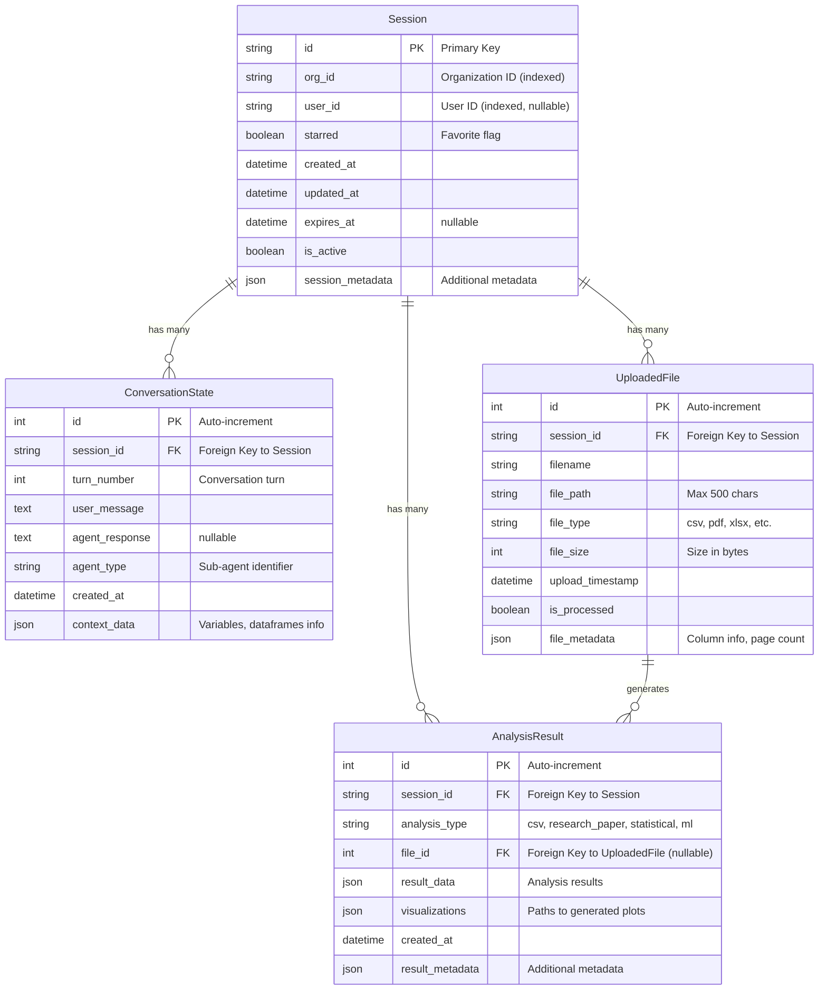
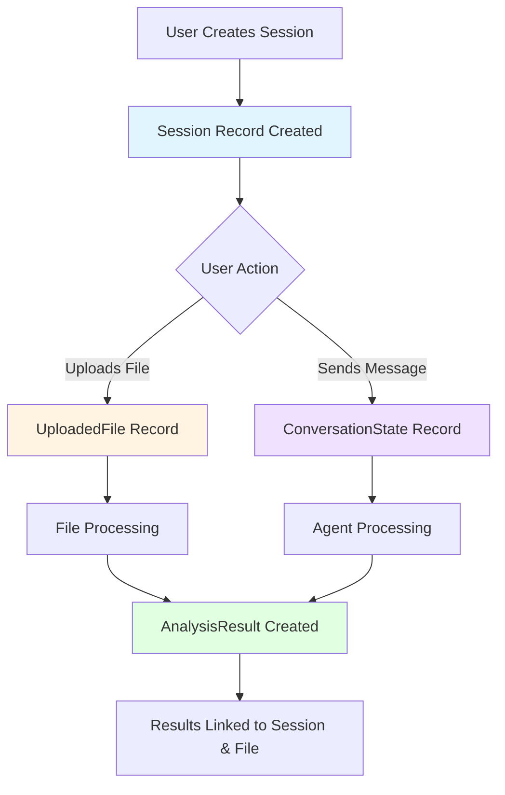
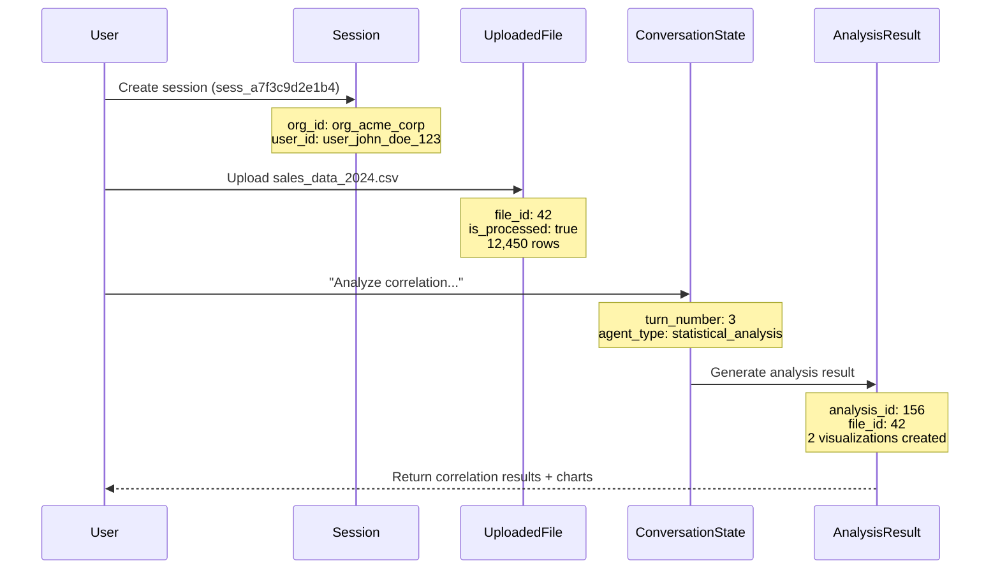

# Database Structure - Data Science ML Agent

## Overview

The database structure consists of **4 main tables** that support multi-tenant session management, file uploads, conversation tracking, and analysis results storage. All tables use the `chatbot_` prefix for clear namespace identification.

## Entity Relationship Diagram



## Table Details

### 1. **Session** (`chatbot_sessions`)
**Purpose**: Central table for managing user sessions with multi-tenancy support

**Key Features**:
- Uses string-based primary key (`id`) instead of auto-increment
- Multi-tenant architecture via `org_id` (indexed for performance)
- Optional `user_id` for user-specific sessions
- Starred/favorite functionality for important sessions
- Automatic timestamp tracking (`created_at`, `updated_at`)
- Session expiration support via `expires_at`
- Cascade delete: Deleting a session removes all related data

**Relationships**:
- One-to-Many with `ConversationState`
- One-to-Many with `UploadedFile`
- One-to-Many with `AnalysisResult`

---

### 2. **ConversationState** (`chatbot_conversation_states`)
**Purpose**: Track conversation history and maintain context across interactions

**Key Features**:
- Sequential turn tracking via `turn_number`
- Stores both user messages and agent responses
- Identifies which sub-agent handled each turn (`agent_type`)
- JSON context storage for variables, dataframe metadata, etc.
- Indexed on `session_id` for fast lookups

**Use Cases**:
- Conversation history retrieval
- Context maintenance for multi-turn dialogues
- Agent routing and specialization tracking

---

### 3. **UploadedFile** (`chatbot_uploaded_files`)
**Purpose**: Track files uploaded by users for analysis

**Key Features**:
- Supports multiple file types (CSV, PDF, XLSX, etc.)
- Stores file metadata (columns, page count, etc.) as JSON
- Processing status tracking via `is_processed` flag
- File size tracking in bytes
- Indexed on `session_id` for efficient queries

**Metadata Examples**:
- CSV: column names, row count, data types
- PDF: page count, text extraction status
- XLSX: sheet names, cell ranges

---

### 4. **AnalysisResult** (`chatbot_analysis_results`)
**Purpose**: Store analysis results for reuse and reference

**Key Features**:
- Multiple analysis types: `csv`, `research_paper`, `statistical`, `ml`
- Optional link to source file via `file_id` (nullable for non-file analyses)
- JSON storage for flexible result data structures
- Visualization paths stored as JSON array
- Indexed on `session_id` for performance

**Relationships**:
- Belongs to a `Session`
- Optionally linked to an `UploadedFile`

---

## Data Flow



## Key Design Patterns

### 1. **Multi-Tenancy**
- `org_id` in `Session` enables organization-level data isolation
- Indexed for efficient filtering across large datasets

### 2. **Cascade Deletion**
- All child records (conversations, files, results) are automatically deleted when a session is removed
- Maintains referential integrity

### 3. **Flexible JSON Storage**
- `session_metadata`, `file_metadata`, `context_data`, `result_data`, `visualizations`
- Allows schema evolution without migrations
- Stores complex, nested data structures

### 4. **Temporal Tracking**
- All tables include timestamp fields
- `Session` has both `created_at` and `updated_at` with automatic updates
- Enables audit trails and time-based queries

### 5. **Indexing Strategy**
- Foreign keys (`session_id`) are indexed
- `org_id` and `user_id` are indexed for multi-tenant queries
- Optimizes common query patterns

## Common Query Patterns

### Get All Session Data
```python
# Retrieve session with all related data
session = db.query(Session).filter(Session.id == session_id).first()
conversations = session.conversation_states
files = session.uploaded_files
results = session.analysis_results
```

### Get Analysis Results for a File
```python
# Find all analyses performed on a specific file
results = db.query(AnalysisResult).filter(
    AnalysisResult.file_id == file_id
).all()
```

### Get User's Sessions by Organization
```python
# Multi-tenant query
sessions = db.query(Session).filter(
    Session.org_id == org_id,
    Session.user_id == user_id,
    Session.is_active == True
).all()
```

## Example Records (PostgreSQL Format)

### chatbot_sessions

| id | org_id | user_id | starred | created_at | updated_at | expires_at | is_active | session_metadata |
|---|---|---|---|---|---|---|---|---|
| sess_a7f3c9d2e1b4 | org_acme_corp | user_john_doe_123 | t | 2025-11-27 08:15:30 | 2025-11-27 13:42:15 | 2025-12-27 08:15:30 | t | {"project_name": "Q4 Sales Analysis", "tags": ["sales", "quarterly", "important"], "last_activity": "data_visualization"} |
| sess_b8e4d0c3f2a5 | org_acme_corp | user_jane_smith_456 | f | 2025-11-26 14:30:00 | 2025-11-26 16:45:22 | 2025-12-26 14:30:00 | t | {"project_name": "Customer Segmentation", "tags": ["ml", "clustering"]} |
| sess_c9f5e1d4a3b6 | org_techstart_inc | user_bob_wilson_789 | t | 2025-11-25 09:00:00 | 2025-11-27 11:20:10 | 2025-12-25 09:00:00 | t | {"project_name": "Predictive Maintenance", "tags": ["ml", "time_series", "production"]} |

### chatbot_conversation_states

| id | session_id | turn_number | user_message | agent_response | agent_type | created_at | context_data |
|---|---|---|---|---|---|---|---|
| 1 | sess_a7f3c9d2e1b4 | 1 | Load the sales data from the CSV file | I've loaded the sales data. The dataset contains 12,450 rows and 5 columns: date, region, total_revenue, ad_spend, and units_sold. | csv_analysis | 2025-11-27 08:25:10 | {"active_dataframe": "sales_data_2024", "row_count": 12450, "columns": ["date", "region", "total_revenue", "ad_spend", "units_sold"]} |
| 2 | sess_a7f3c9d2e1b4 | 2 | Show me the summary statistics | Here are the summary statistics for the numerical columns... | statistical_analysis | 2025-11-27 13:30:45 | {"active_dataframe": "sales_data_2024", "operations": ["describe"]} |
| 3 | sess_a7f3c9d2e1b4 | 3 | Can you analyze the correlation between sales and marketing spend? | I've analyzed the correlation. The Pearson coefficient is 0.87, indicating a strong positive relationship. | statistical_analysis | 2025-11-27 13:42:15 | {"active_dataframe": "sales_data_2024", "variables": {"sales_column": "total_revenue", "marketing_column": "ad_spend"}, "previous_operations": ["load_csv", "clean_data", "correlation_analysis"]} |
| 4 | sess_b8e4d0c3f2a5 | 1 | Perform k-means clustering on customer data | I've performed k-means clustering with k=4. The silhouette score is 0.72. | ml_analysis | 2025-11-26 15:10:30 | {"active_dataframe": "customer_data", "model_type": "kmeans", "n_clusters": 4, "features": ["age", "income", "purchase_frequency"]} |

### chatbot_uploaded_files

| id | session_id | filename | file_path | file_type | file_size | upload_timestamp | is_processed | file_metadata |
|---|---|---|---|---|---|---|---|---|
| 42 | sess_a7f3c9d2e1b4 | sales_data_2024.csv | /uploads/org_acme_corp/sess_a7f3c9d2e1b4/sales_data_2024.csv | csv | 2457600 | 2025-11-27 08:20:45 | t | {"columns": ["date", "region", "total_revenue", "ad_spend", "units_sold"], "row_count": 12450, "data_types": {"date": "datetime", "region": "string", "total_revenue": "float", "ad_spend": "float", "units_sold": "integer"}, "missing_values": {"ad_spend": 23, "units_sold": 5}, "encoding": "utf-8"} |
| 43 | sess_b8e4d0c3f2a5 | customer_profiles.xlsx | /uploads/org_acme_corp/sess_b8e4d0c3f2a5/customer_profiles.xlsx | xlsx | 1843200 | 2025-11-26 14:35:20 | t | {"sheets": ["Customers", "Transactions"], "row_count": 8500, "columns": ["customer_id", "age", "income", "purchase_frequency", "lifetime_value"], "encoding": "utf-8"} |
| 44 | sess_c9f5e1d4a3b6 | sensor_readings.csv | /uploads/org_techstart_inc/sess_c9f5e1d4a3b6/sensor_readings.csv | csv | 5242880 | 2025-11-25 09:15:00 | t | {"columns": ["timestamp", "sensor_id", "temperature", "pressure", "vibration"], "row_count": 45000, "data_types": {"timestamp": "datetime", "sensor_id": "string", "temperature": "float", "pressure": "float", "vibration": "float"}, "missing_values": {}, "encoding": "utf-8"} |

### chatbot_analysis_results

| id | session_id | analysis_type | file_id | result_data | visualizations | created_at | result_metadata |
|---|---|---|---|---|---|---|---|
| 156 | sess_a7f3c9d2e1b4 | statistical | 42 | {"correlation_matrix": {"total_revenue_vs_ad_spend": 0.87, "total_revenue_vs_units_sold": 0.95, "ad_spend_vs_units_sold": 0.82}, "summary_statistics": {"total_revenue": {"mean": 125430.50, "median": 118200.00, "std_dev": 34567.89}}, "insights": ["Strong positive correlation between marketing spend and revenue", "Units sold is the strongest predictor of revenue"]} | ["/visualizations/sess_a7f3c9d2e1b4/correlation_heatmap_156.png", "/visualizations/sess_a7f3c9d2e1b4/scatter_plot_revenue_vs_spend_156.png"] | 2025-11-27 13:42:20 | {"execution_time_ms": 1250, "library_versions": {"pandas": "2.1.0", "numpy": "1.24.3", "scipy": "1.11.2"}, "confidence_level": 0.95} |
| 157 | sess_b8e4d0c3f2a5 | ml | 43 | {"model_type": "kmeans", "n_clusters": 4, "silhouette_score": 0.72, "cluster_sizes": [2100, 2300, 1950, 2150], "cluster_centers": [[35, 45000, 2.5], [52, 78000, 5.2], [28, 32000, 1.8], [45, 62000, 3.9]]} | ["/visualizations/sess_b8e4d0c3f2a5/cluster_scatter_157.png", "/visualizations/sess_b8e4d0c3f2a5/elbow_plot_157.png"] | 2025-11-26 15:12:45 | {"execution_time_ms": 3450, "library_versions": {"scikit-learn": "1.3.0", "pandas": "2.1.0"}, "random_state": 42} |
| 158 | sess_c9f5e1d4a3b6 | ml | 44 | {"model_type": "lstm", "prediction_horizon": 24, "mae": 2.34, "rmse": 3.12, "r2_score": 0.89, "anomaly_count": 127} | ["/visualizations/sess_c9f5e1d4a3b6/prediction_plot_158.png", "/visualizations/sess_c9f5e1d4a3b6/anomaly_detection_158.png"] | 2025-11-27 11:25:30 | {"execution_time_ms": 12500, "library_versions": {"tensorflow": "2.14.0", "pandas": "2.1.0"}, "epochs": 50, "batch_size": 32} |

## Complete Data Flow Example

Here's how these records work together in a typical user session:



## Database Technology

- **ORM**: SQLAlchemy
- **Base Class**: Declarative base from `api.db.base`
- **Supported Databases**: Any SQLAlchemy-compatible database (PostgreSQL, MySQL, SQLite, etc.)
